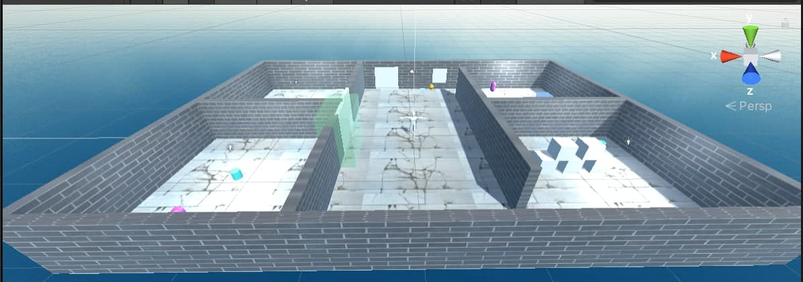
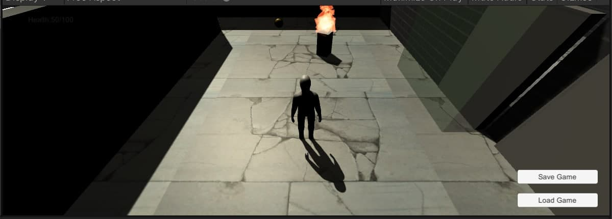
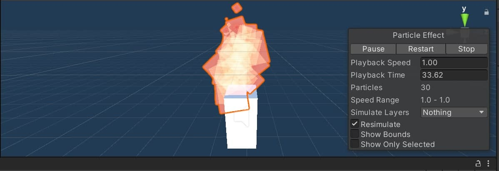
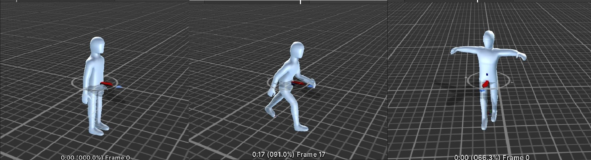
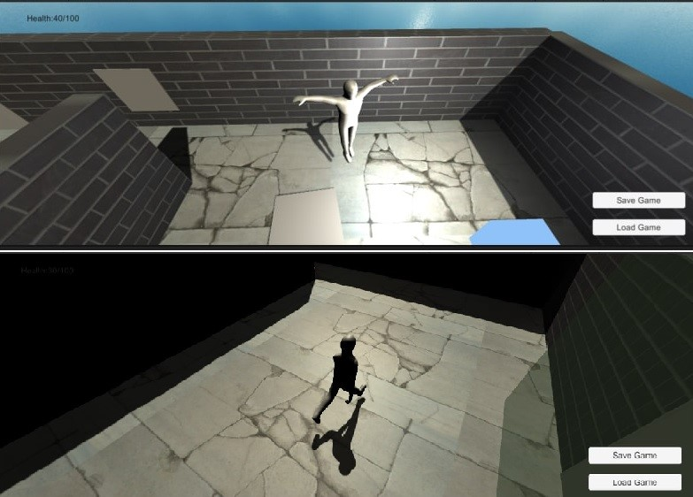
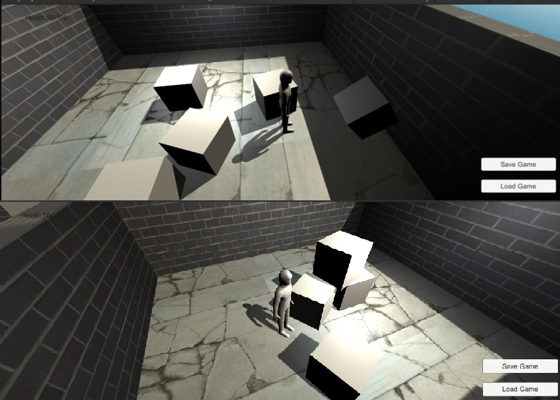
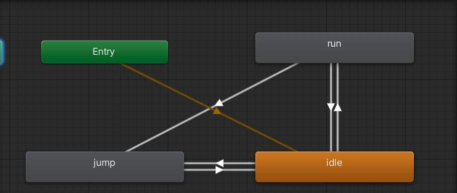
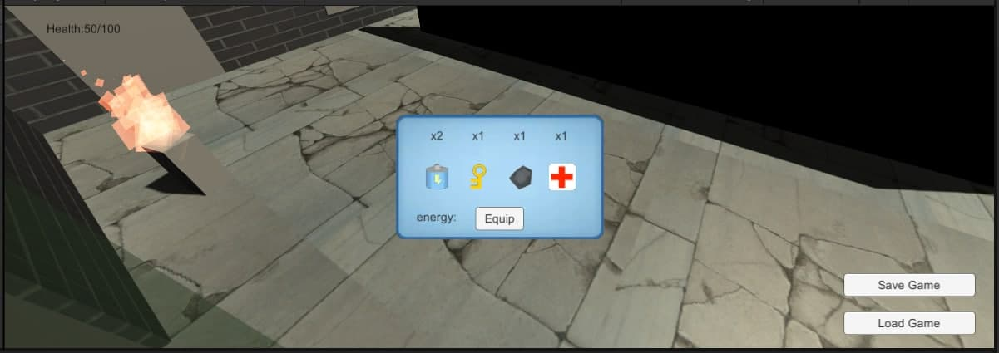
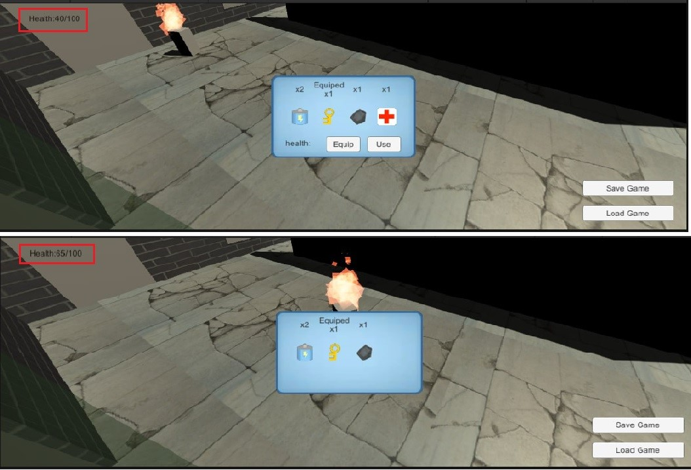

# Тестовое приложение игры (Игра от третьего лица)
* ## Общее описание
Данный проект представляет собой шутер от третьего лица в 3D графике, созданный при помощи игрового движка Unity.
> Это тренировочное приложение и не представляет собой полноценную игру!

Цель: собирать инвентарь, избегать врага, найти точку перехода на новый уровень и, в дальнейшем, завершить игру.

Общий вид сцены:

 
 
* ## Особенности реализации
* ### Управление и камера
Игрок управляется с помощью мыши: при нажатии мыши в любую точку сцены, игрок будет туда идти (работает только при нажатии на пол сцены). Камера находится на определенном
расстоянии от игрока и управляется при помощи клавиш, облетая игрока вокруг.

В игре это выглядит так:

 * ### Враг
Враг является шаблоном (prefab) и добавляется в игру посредством кода. Враг представляет
собой простейший AI, который разворачивается в произвольном направлении, когда видит перед собой препятствие в виде стены,
если напротив него появляется игрок, то враг производит выстрел, чем наносит урон игроку при попадании. 
Также враг "пылает" за счет использования системы частиц (particle system), имитирующей огонь и издает соотвествующий звук пламени.

* ### Анимация перемещения модели игрока
Модель игрока является анимированной, он имеет три состояния: обычное (стоит с опущенными руками), прыжок (активируется при нажатии пробела), бег (активируется, когда 
игрок идет). 

Игрок может подниматься на наклонные поверхности, а так же запрыгивать и спрыгивать с них. 

Также игрок может рушить препятсвия (например, стену из коробок).

Контроллер-аниматор:

* ### Инвентарь
В данной игре имеется "инвентарь", разбросанный по сцене, который игрок подбирает при столкновении с ним. Собранный инвентарь можно посмотреть в багаже (нажатие кнопки M).

Некоторые объекты, например, ключ, можно "подготовить" к использованию, чтобы открыть дверь. Другие, как здоровье, можно использовать для повышения каких-либо параметров 
игрока.

* ### Сохрание, загрузка и прохождение игры
В данной игре есть три уровня, в каждом из которых есть точка, при достижении которой игрок переходит на новый уровень. При прохождении всех уровней игра завершается.
Процесс игры можно сохранить, нажав кнопку "Save Game" (данные о состоянии игрока и его инвентаря сериализуются в бинарный файл и таким образом хранятся). При следующем 
запуске игры можно загрузить сохраненные данные при помощи кнопки "Load Game": весь сохраненный инвентарь вернется к игроку и он окажется на том уровне, на каком сохранился.

